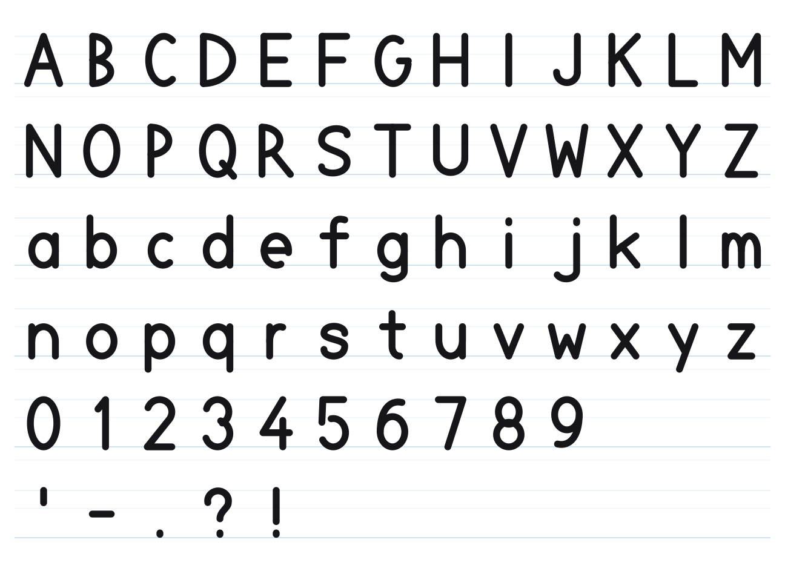

# spelling-buddy

A procedural 2.5D character rig for the web. The character is **mathematics, not
artwork** — there are no PNGs, no sprite sheets, and no runtime dependencies. Every
shape is an arc, an ellipse, or a Bézier curve, evaluated per frame.

That one decision is what makes the rest possible:

- **Infinite resolution.** Renders identically at 24px in a toolbar and at 2000px on a projector.
- **It deforms.** Squash-and-stretch, head turns, and expression blends are computed, so poses interpolate instead of snapping between fixed frames.
- **It turns.** Facial features live on a sphere; yaw and pitch rotate them. Profile views, over-the-shoulder peeks, and full 360° turnarounds come from the same nine expressions.
- **One rig, many outputs.** The identical drawing code renders live to Canvas2D *and* emits real SVG geometry, PNG stills, sprite sheets, and GIFs. Assets cannot drift from runtime, because there is only one source.

~34 kB minified. Zero dependencies.

---

## Documentation

| | |
|---|---|
| **[docs/index.html](./docs/index.html)** | **Live docs — every example runs in the page**, including an interactive explainer for the sphere projection |
| [Getting started](./docs/01-getting-started.md) | install, first buddy, sizing, cleanup, performance |
| [API reference](./docs/02-api.md) | every option, method, event, and adapter |
| [Expressions & animations](./docs/03-animations.md) | the full catalog, plus adding your own |
| [Theming](./docs/04-theming.md) | brand tokens, custom palettes |
| [Integration recipes](./docs/05-integration.md) | wiring it into a real lesson flow |
| [Asset export](./docs/06-export.md) | SVG, PNG, sprite sheets, GIF, CI diffing |
| [Architecture](./docs/07-architecture.md) | how the turn, springs and backends work |
| [Troubleshooting](./docs/08-troubleshooting.md) | real failure modes and fixes |
| [Speech & visemes](./docs/09-speech.md) | mouth shapes, letter names, lip-sync |
| [Tracing & cues](./docs/10-tracing.md) | letter formation, audio hooks |

---

## Install

```bash
npm install spelling-buddy
```

Or drop the bundle in and skip the build step entirely:

```html
<script src="spelling-buddy/dist/spelling-buddy.global.js"></script>
```

---

## Quick start

### Vanilla

```js
import { mount } from 'spelling-buddy'

const { buddy } = mount('#buddy', { theme: 'ink', size: 240 })

buddy.express('thinking')   // while the learner is typing
buddy.react('correct')      // on a right answer
buddy.spell('cat')          // hold up each letter, then celebrate
buddy.sayLetters('cat')     // articulate the letter names
buddy.trace('a')            // show how the letter is formed
buddy.traceWord('cat')      // …every letter in turn
```

### React

```jsx
import { SpellingBuddy } from 'spelling-buddy/react'

<SpellingBuddy
  size={240}
  theme="ink"
  expression={isTyping ? 'thinking' : 'happy'}
  action={result === 'right' ? 'correct' : result === 'wrong' ? 'wrong' : undefined}
/>
```

Or drive it imperatively:

```jsx
import { useBuddy } from 'spelling-buddy/react'

function Lesson() {
  const { canvasRef, react, spell } = useBuddy({ theme: 'ink', size: 240 })
  return (
    <>
      <canvas ref={canvasRef} style={{ width: 240, height: 240 }} />
      <button onClick={() => spell('CAT')}>Show me</button>
    </>
  )
}
```

### Web Component

```html
<script type="module">
  import { defineSpellingBuddy } from 'spelling-buddy/element'
  defineSpellingBuddy()
</script>

<spelling-buddy theme="ink" size="240" expression="happy" idle></spelling-buddy>
```

```js
document.querySelector('spelling-buddy').react('correct')
```

---

## API

### `new Buddy(options)` / `mount(canvas, options)`

| Option | Default | |
|---|---|---|
| `theme` | `'ink'` | name, or a partial override object |
| `seed` | `1` | PRNG seed — same seed gives identical output |
| `expression` | `'happy'` | starting expression |
| `autoLook` | `true` | eyes and head track the cursor when idle |
| `idleActions` | `false` | spontaneously look around / think |
| `showHands` | `false` | hands normally appear only when an animation needs them |
| `showShadow` `showSparks` `showBlush` `showTrail` | `true` | part toggles |
| `scale` `tempo` `bobAmt` `breathAmt` `blinkEvery` | `1`, `1`, `1`, `1`, `3.2` | motion tuning |

`mount()` adds `size`, `interactive`, `dragToTurn`, `clickToPop`, `autoStart`, `maxDPR`.

### Phases — the recommended surface

Everything else is rig-level. A phase is lesson-level: it says what the
*learner* is doing, and the choreography lives in one place, so page twenty
behaves like page one.

```js
buddy.phase('typing')
buddy.phase('correct')                      // celebrates, then returns to idle
buddy.phase('stuck',    { word: 'cat' })    // spells it — without celebrating
buddy.phase('teaching', { letter: 'g' })    // traces it
```

```jsx
<SpellingBuddy phase={status} word={word} nonce={attempts} />
```

`idle` · `typing` · `correct` · `wrong` · `stuck` · `teaching`

Idempotent, so it is safe to call from a render; momentary phases fall back to
a steady one by themselves; entering a phase cancels the last one's work.
[`integrations/nextjs`](./integrations/nextjs) has a drop-in App Router wrapper.

### Methods

```js
buddy.express('proud')          // set expression, cross-faded
buddy.react('turnaround')       // play a special animation
buddy.spell('CAT')              // letter-by-letter, then celebrate
buddy.hold('B')                 // hold one letter card
buddy.face(45, -10)             // point the head (degrees)
buddy.turnBy(0.2)               // relative turn, radians (drag gestures)
buddy.setTheme('blue')
buddy.pointer(x, y, inside)     // feed normalised cursor position
buddy.reset()

buddy.on('action:end', name => …)
buddy.on('spell:letter', ch => …)
buddy.on('spell:done', () => …)

buddy.busy        // an action or spell is running
buddy.expression  // current expression name
buddy.yawDeg      // where the head is pointing
```

### Characters

A theme changes colour. A **character** changes proportion — ear shape, how far
apart the eyes sit, how low the face is, whether there is a face patch at all.

```js
mount('#buddy', { character: 'bun' })
buddy.setCharacter('bear')
```

`pip` · `bun` · `bear` · `sprout` · `pebble`

Each is a dozen numbers plus a palette, both plain data, so a new one is a
config entry rather than new drawing code. Three proportions do most of the
work: **small features set low and close together** (wide-set eyes read as an
adult face at any size), **no face patch** (a light disc inside a darker ring
reads as a bowling ball however good the face inside it is), and **blush beside
the eyes** rather than at some absolute point on the head.

### Shading

The character is shaded, and the shading is derived from the body colour rather
than authored per theme — the brand colour is the gradient's **middle** stop, so
it is actually present rather than approximated. Gradients are plain data
(`{type, coords, stops}`) in the path's own space, which is what lets canvas and
exported SVG produce the same pixels. Measured cost: 0.080 → 0.095 ms/frame.

Green stays feedback-only. Shading gives depth *within* the body colour; it is
not a licence to make the character green.

### Expressions

`happy` · `excited` · `thinking` · `surprised` · `proud` · `sleepy` · `confused` · `dizzy` · `content`

### Speech

Ten blendable viseme shapes, so the mouth articulates rather than flaps.

```js
buddy.sayLetters('CAT')     // letter NAMES — exact, 26-entry table
buddy.say('through')        // words — approximate from spelling
buddy.sayVisemes([['MBP', 0.08], ['AI', 0.22]])   // exact control
buddy.attachSpeech(utterance)                      // follow Web Speech audio
```

### The alphabet



`A–Z`, `a–z` and `0–9`, drawn as monoline strokes rather than set in a font —
so they render identically everywhere, at any size, with nothing installed.

**Case is preserved everywhere.** `hold('a')`, `spell('cat')` and `trace('g')`
show lowercase, on the real baseline, with a real x-height and real descenders.
Most early-years curricula teach lowercase first, and a rig that quietly
upper-cases its input is unusable for those lessons.

```
cap        -0.5     ── b d f h k l t
x-line     -0.12    ── a c e o
baseline    0.5     ──
descender   0.78    ── g j p q y
```

### Tracing

```js
buddy.trace('a')            // the letter draws itself, stroke by stroke
buddy.on('trace:done', …)
```

Nearly free: the glyphs are monoline strokes, so their path data is already the
pen's centreline. The coordinates that draw a letter also describe how to write
one — something a filled-outline font cannot tell you.

And the other direction — the child traces, you grade it:

```js
import { scoreTrace, identifyTrace } from 'spelling-buddy'

scoreTrace('A', paths)
// { score, accuracy, coverage, direction, verdict, hint, strokesHit }

scoreTrace('b', paths, { diagnose: true })
// … plus reversed: true, looksLike: 'd'
```

Three metrics, not one: distance alone lets a scribble in one corner pass.

And a grade is not a lesson. A child who draws a `d` when asked for a `b` has
not failed to control the pencil — they know the letter and wrote its mirror,
which is the most common early-years handwriting error there is. `diagnose`
mirrors their own marks and re-scores against the same target, so the app can
say *"that's a b written backwards"* instead of *"try again"*. No table of
mirror-pairs; it catches a backwards `3` too.

### Reference lesson

`examples/lesson.html` is the whole loop in ~180 lines — typing feedback,
answer checking, spelling aloud, tracing, finger-tracing scored live, and sound
synthesised from cues with no audio files.

### Accessibility

`mount()` gives the canvas `role="img"` and a label, and announces the moments
that carry information — `spell()`, `hold()`, `trace()` — through an off-screen
`aria-live` region it creates and cleans up itself. The word is announced once,
not letter by letter. Feedback is left to the host, because the host almost
always shows its own. All of it is overridable, and `announce: false` opts out.

`prefers-reduced-motion` is respected: the idle bob and motion trail stop, the
expressions stay.

### Audio cues

The rig makes no sound; it reports when something worth hearing happened.

```js
buddy.on('cue', ({ name, detail }) => sfx.play(name))
// correct · wrong · pop · land · letter · trace:start · trace:stroke · trace:done
```

### Special animations

| | |
|---|---|
| **Feedback** | `correct` `wrong` `nod` |
| **Turn** | `turnaround` `peek` `lookAround` |
| **Physical** | `jump` `dizzy` |
| **Social** | `wave` `dance` |
| **Idle** | `sleep` `think` |
| **Micro** | `pop` |

---

## Themes

Colours live in one object; nothing in the drawing code hard-codes a value.

| theme | body | notes |
|---|---|---|
| `ink` | `#16161A` | default — the action colour on white canvas |
| `blue` | `#1478C9` | selection blue |
| `cream` | `#16161A` | ink on a warm editorial field |
| `indigo` | `#4A56D8` | original exploration colour |
| `soft` | `#2E2E38` | ears, hairline and shading — no contour anywhere |
| `sky` | `#3A9BE6` | the same, on selection blue |
| `sunny` | `#F6D65B` | the same, warm. Yellow is not a v4.1 token — an exploration, not a default |

Green (`#2CB02B`) appears **only** on correct-answer feedback; it is never decoration.

Override any slot:

```js
mount('#buddy', {
  theme: { extends: 'ink', body: '#0B2A4A', spark: '#FFC94A' }
})
```

---

## Asset export

Everything below comes out of the same rig, so exported art always matches what
ships at runtime.

```bash
npx spelling-buddy sheet                       # one SVG character sheet
npx spelling-buddy alphabet                    # A–Z a–z 0–9 on ruled paper
npx spelling-buddy svg    --out assets/svg     # per-pose SVGs, zero deps
npx spelling-buddy png    --size 512           # rasterised stills
npx spelling-buddy sprite --action correct     # sprite-sheet PNG
npx spelling-buddy gif    --action wave        # animated GIF
```

`svg`, `sheet` and `alphabet` need nothing installed. `png` / `sprite` / `gif` use `sharp`
(optional dependency) and, for GIF, `ffmpeg`.

Programmatically:

```js
import { poseSVG, sheetSVG, toSVG } from 'spelling-buddy'

poseSVG({ expression: 'proud', yaw: 45 })                 // → '<svg …>'
toSVG(buddy, { width: 512 })                              // snapshot the live rig
sheetSVG([{ expression: 'happy' }, { yaw: 90 }], { cols: 4 })
```

Frames are produced from a seeded PRNG at a fixed timestep, so exporting twice
gives byte-identical output — safe to commit and to diff in CI.

---

## How it works

### The projection

Each facial feature is given a position on the surface of a sphere. `yaw` and
`pitch` rotate that sphere; an orthographic projection returns the 2D position
*and* the local foreshortening factors, so eyes compress correctly approaching
profile and fade off the terminator instead of popping.

A true projection would slide features all the way out to the silhouette, where
they overhang the body edge. The rig applies a *wrap cheat* — features travel
about 45% less at full profile — but only to the face group's anchor point.
Feature spacing within the face still uses the honest projection, so the eyes
don't crowd together. Travel is stylised; foreshortening is physical.

### Springs, not tweens

Every impulse is injected as *velocity* into a damped spring rather than played
as an eased keyframe. Eased tweens arrive and stop; springs overshoot and settle.
That is what reads as weight. Animations set spring **targets** and inject
impulses — they never assign positions directly, which is why hand-authored
beats and physical settling don't fight each other.

### One Surface, two backends

The rig draws against a small interface — `ellipse`, `arc`, `fill`, `stroke`,
`clip`, `text`. `CanvasSurface` forwards those to Canvas2D. `SVGSurface` turns
them into path data, converting arcs to cubic Béziers the way any vector tool
does. Neither backend knows anything about the character.

Add an expression once, and it appears at runtime, in exported SVG, in the
sprite sheet, and in the GIF.

---

## Development

```bash
npm test        # behaviour (163 checks) + visual regression (invariants + 72 snapshots)
npm run build   # dist bundles (IIFE + ESM, minified and not)
npm run snapshot # re-record visual snapshots after an intentional art change
npm run assets  # regenerate the SVG asset set
open demo/index.html
```

The demo renders the live canvas beside an SVG exported from the same rig each
frame — if the two backends ever diverge, you see it immediately.

## License

MIT
