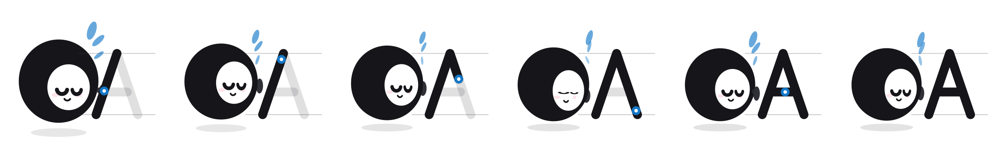

# Letter tracing & audio cues

## Tracing

```js
buddy.trace('A')
buddy.trace('g')   // lowercase, with its own x-line and descender rule
```

The character steps aside and a letter draws itself, stroke by stroke, in the
order and direction you'd write it — with the pencil visibly lifting between
strokes. The buddy watches the pen and points at it.

Ruled paper is drawn behind it: the cap line, the x-line and the baseline
always, plus the descender rule for letters that go below it. Without the
x-line a lowercase `o` has nothing to sit against, and "short letters stop
here" is not something the child can see.



### Why this was nearly free

The glyphs are **monoline strokes**, so their path data is already the pen's
centreline. The same coordinates that draw an "A" also describe how to write
one. Tracing needed no new artwork — the alphabet just had to be sampled by
arc length instead of stroked all at once.

A filled-outline font cannot do this. Outlines describe the *edge* of the ink,
not the path through it, so recovering stroke order from one means skeletonising
the shape and guessing where the pen went. This is the second time the decision
to draw the letters ourselves has paid for itself.

### Options

```js
buddy.trace('B', {
  duration: 2.4,   // seconds for the whole letter
  hold: 0.7,       // pause on the finished letter before returning
})

buddy.stopTrace()
buddy.tracing      // boolean
```

Duration is spread across the letter **by arc length**, so a long stroke takes
proportionally longer than a short one and the pen moves at a constant speed —
which is what makes it read as handwriting rather than as a progress bar.

Between strokes the pen lifts for 10% of the total time. That gap is most of
what makes a trace legible as instruction: without it, the stem and crossbar of
an A look like one continuous scribble.

### Events

```js
buddy.on('trace:start', ch => …)
buddy.on('trace:done',  ()  => …)
```

### Driving it from a lesson

```js
// the learner got it wrong twice — show them the shape
if (attempts >= 2) {
  buddy.trace(word[errorIndex])
  buddy.on('trace:done', () => input.focus())
}
```

### Reading the pen yourself

If you want to drive your own canvas — a tracing exercise where the child
follows the path with a finger — the geometry is exported:

```js
import { penAt, glyphPath, flattenGlyph } from 'spelling-buddy'

penAt('A', 0.5)      // → { x, y, stroke, into, penUp }  in cap-height units
glyphPath('A')       // → { strokes: [{ pts, cum, len }], len }
```

`pts` are the sampled polyline points, `cum` their cumulative arc length. That's
everything you need to score how closely a traced finger followed the path.

---

## Tracing a whole word

```js
buddy.traceWord('CAT', { duration: 2.0, gap: 0.35 })
buddy.on('traceWord:done', () => …)
```

Each letter in turn, with a pause between. `stopTrace()` cancels the queue.

---

## Scoring a learner's trace

The interesting direction is the other one: the child traces, and you grade it.

```js
import { scoreTrace } from 'spelling-buddy'

const result = scoreTrace('A', paths)
// { score, accuracy, coverage, direction, verdict, hint, strokesHit, strokes }
```

`paths` is **one path per pen-down** — `[[[x,y], …], …]` — in the same
cap-height units the glyph uses. From screen coordinates:

```js
const toGlyph = (x, y) => [(x - centreX) / capHeight, (y - centreY) / capHeight]
```

`centreX, centreY` is wherever you drew the letter: the glyph geometry is
horizontally centred on its own ink, exactly as `drawGlyph` and `drawTrace`
place it, so what the learner sees and what they are scored against are the
same coordinates. No offset to apply.

A single flat path is accepted too, but scores lower on multi-stroke letters:
joining the strokes draws a line through empty space that matches nothing, so a
two-stroke letter can't beat about 0.72 that way.

### What it measures

| | |
|---|---|
| `accuracy` | how close their marks were to the line |
| `coverage` | how much of the letter they visited, **averaged per stroke** |
| `direction` | whether they travelled along each stroke the way it's written |

Three metrics rather than one, because distance alone is not enough. A child who
scribbles densely over one corner of an A scores well on distance while having
drawn nothing like an A — coverage is what catches that. And tracing a letter
bottom-to-top is consistent, and still the wrong lesson — that's what direction
catches.

Coverage is averaged **per stroke**, not per point: weighted by points, an A's
106-point diagonals drown out its 18-point crossbar, and skipping the bar
entirely still scored "great". Every stroke matters equally, however short.

A mark also only credits the stroke it is *nearest* to. Without that, tracing
an A's diagonals also "covers" its crossbar, because the diagonals pass within
a tolerance of it.

### Verdicts and hints

`verdict` is one of `great` · `good` · `close` · `again`.
`hint` names the weakest component, so you can say something useful:

| hint | what to tell them |
|---|---|
| `finish` | "you missed part of the letter" |
| `stay-on` | "try to stay on the grey line" |
| `direction` | "start at the top" |

```js
const r = scoreTrace(ch, paths)
if (r.verdict === 'great') buddy.react('correct')
else say({ finish: 'Trace the whole letter.',
           'stay-on': 'Follow the grey line.',
           direction: 'Start at the top.' }[r.hint])
```

### Reversals, and what they actually drew

```js
const r = scoreTrace('b', paths, { diagnose: true })
// … plus: reversed, mirrorScore, looksLike, looksLikeScore
```

A bare score says *how badly*. It cannot say *what went wrong* — and for a
five-year-old the difference matters. A child who draws a `d` when asked for a
`b` has not failed to control the pencil; they know the letter and wrote its
mirror. That is the most common early-years handwriting error there is, and
"Have another go" is the wrong response to it.

| | |
|---|---|
| `reversed` | their own marks, mirrored, fit the target |
| `looksLike` | the letter they appear to have drawn instead, or `null` |

```js
if (r.reversed)      say(`That's a ${ch} written backwards — it faces the other way.`)
else if (r.looksLike) say(`That looks like a ${r.looksLike}.`)
else                  say(hints[r.hint])
```

`reversed` is computed by flipping the child's marks in x and re-scoring
against **the same target**. No table of mirror-pairs to maintain, and it
catches a backwards `3` or `S` too — shapes that have no mirror-letter at all.

```js
import { identifyTrace } from 'spelling-buddy'

identifyTrace(paths)             // → [{ ch, score, … }, …] best first
identifyTrace(paths, { candidates: [...'bdpq'], top: 1 })
```

`diagnose` scores the trace against every glyph, so it costs roughly 25 ms
rather than 3. Call it when they submit, never on pointer-move. Narrow
`candidates` to the confusable set if you want it cheaper.

### A caveat worth knowing

The score alone cannot separate every confusable pair. An `o` drawn where an
`a` was asked for still scores well, because with a fat-finger tolerance an `o`
really does lie within a stroke width of most of an `a`. Tightening the
tolerance does not fix it — measured, it costs honest traces more than it costs
wrong ones. `looksLike` is the answer to that question; the score is not.

### Tolerance

```js
scoreTrace('A', paths, { tolerance: 0.16 })   // cap-height units — one stroke width
```

Raise it for younger children or coarse touch input; lower it for handwriting
assessment.

---

## Audio cues

The rig makes no sound. It just says when something worth hearing happened, so
you can attach audio without reverse-engineering animation timings.

```js
buddy.on('cue', ({ name, detail, t }) => sfx.play(name))
```

| Cue | When |
|---|---|
| `correct` | the celebration starts |
| `wrong` | the recoil starts |
| `pop` | a click / poke |
| `land` | the landing beat of `jump` |
| `letter` | a letter card goes up (`detail` is the character) |
| `trace:start` | a trace begins (`detail` is the character) |
| `trace:stroke` | each new stroke starts (`detail` is the stroke index) |
| `trace:done` | the letter is finished |

Cues fire on the exact frame the visual beat happens, which is why `land` exists
separately from the start of `jump` — the sound belongs to the impact, not to
the launch.

Emit your own from custom actions:

```js
ACTIONS.myMove = {
  dur: 1,
  start(B) { B.cue('whoosh') },
  tick(B, p) { B.once(0.6, () => B.cue('thud'), p) },
  end() {},
}
```

### A minimal player

```js
const sounds = {
  correct: new Audio('/sfx/correct.mp3'),
  wrong:   new Audio('/sfx/wrong.mp3'),
  pop:     new Audio('/sfx/pop.mp3'),
  land:    new Audio('/sfx/land.mp3'),
}

buddy.on('cue', ({ name }) => {
  const a = sounds[name]
  if (!a) return
  a.currentTime = 0
  a.play().catch(() => {})     // autoplay policy — ignore until first interaction
})
```

Cues are deterministic: the same seed and timestep produce the same cues at the
same times, so an exported GIF and a soundtrack built from the cue log stay in
sync.
